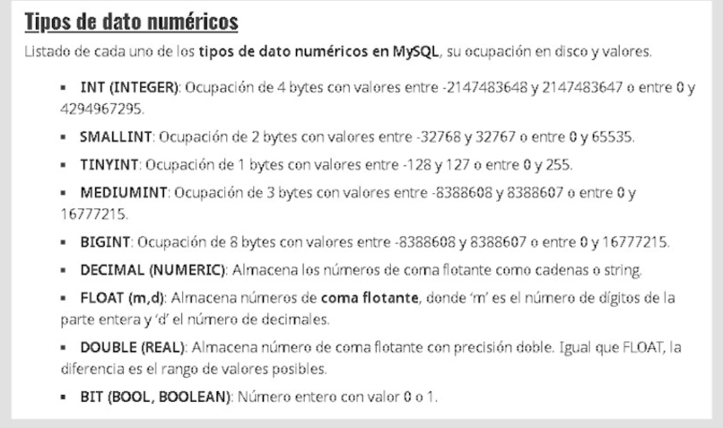

# SQL - Curso completo de Bases de DAtos de 0 a Avanzado

## Section 2

Motores de bases de datos 

### Concepts

- Tablas: colecciones de registros
- Campos
- Registro
- Normalización 

**Campos**
- Datos individulaes que solo pueden alojar un valor
- Tipo de dato correcto de cada campo 

**Índices**

También conocidos como clave

Tres tipos de índices:
- Primary Key: Clave principal de una tabla, valor único que no puede repetirse, generalmente autonumérico. (AUTO_INCREMENT)
- Unique key: Clave Única, valor único que no puede repetirse y no es autonumérico
- Key: Clave común

