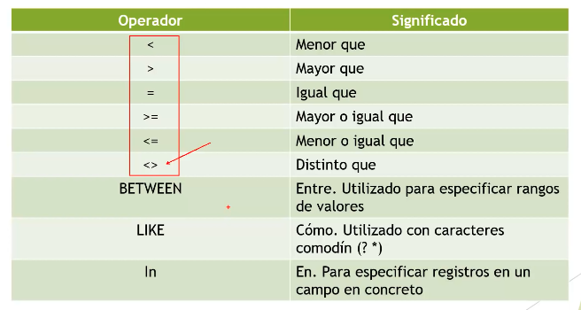

# CLÀUSULAS, OPERADORES Y FUNCIONES


## **Cláusulas**


## **Operadores**



## **Funciones**


```SQL
SHOW TABLES;
SELECT * FROM car;
SELECT id, name, price FROM car WHERE price > 150000; 
SELECT id, name, price FROM car WHERE price > 150000 AND price < 200000; 
# Nota la diferencia entre AND entre estas dos queries
SELECT id, name, price FROM car WHERE color = "NEGRO";
SELECT id, name, price FROM car WHERE color = "NEGRO" AND color = "BLANCO"; #no fuciona
SELECT id, name, price FROM car WHERE color = "NEGRO" AND price > 200000 ORDER BY price DESC;
# tipo de dato es importante considerar el tipo de dato que se le asigna al valor, ej que precio estuviera como varchar y no como int,
# no podría haber operaciones matematicas con > < si el tipo de dato es varchar 
# LA fehca tambiñen funcionaria con operadores <= , cada gestor tiene su propio formato de fecha
SELECT id, name, price, post_date FROM car WHERE post_date BETWEEN '2019-01-01' AND '2020-01-01';

# Consultas de agrupacion
# se puede ordenar pro un campo a la vez
SELECT id, name, price, color FROM car WHERE color = "NEGRO" OR color = "BLANCO" ORDER BY color ASC;
# Ordenar por color y luego por precio, es decir, ppuede haber  multiples criterios de ordenamiento
SELECT id, name, price, color FROM car WHERE color = "NEGRO" OR color = "BLANCO" ORDER BY color, price ASC;
# Consultas de agrupacion de de totales, realizan calculos por campos
# Funciones de agregado SQL


SELECT * FROM car; 

# ej cuanto suman por agrupacion de color, de modelo, de nombre
#campo de agrupacion ej todos los de color negro, campo de calculo precio, thaht is todos los carros color negro suman x, y los rojos y los blancos z
SELECT color, SUM(price) AS 'suma_por_color' FROM car GROUP BY color; 
# AS es un ALIAS
SELECT color, SUM(price) AS 'suma_por_color' FROM car GROUP BY color ORDER BY 'suma_por_color'; 
# En este ejmplo me los agrupa pero no me dice cuantos hay por agrupación
SELECT name FROM car GROUP BY name ORDER BY name;


```